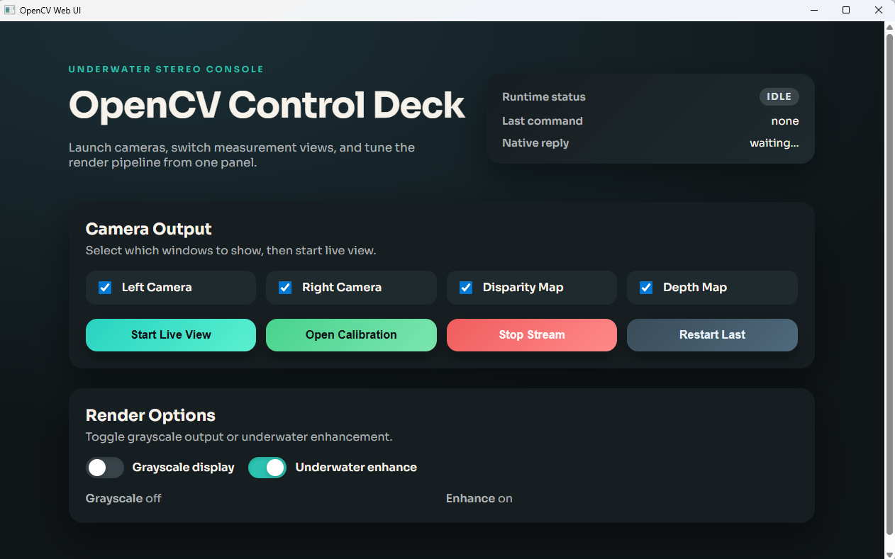
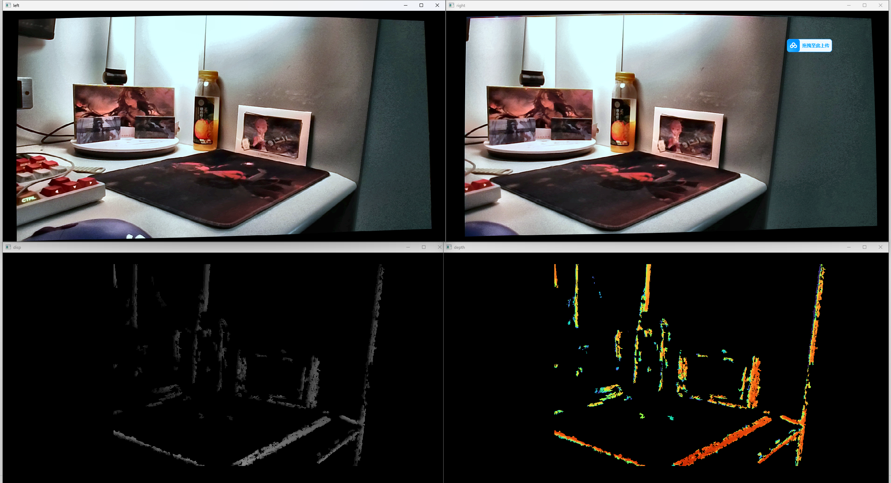
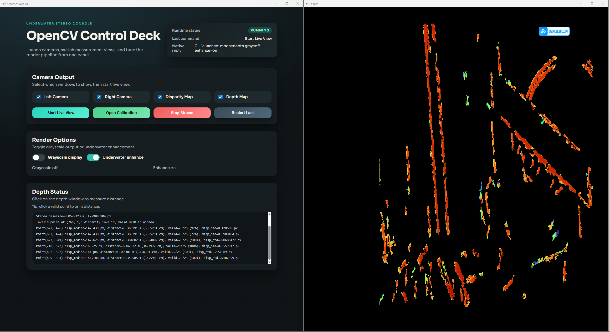

# Binocular_Underwater_Ranging

## 概述
本项目提供一套基于 OpenCV 的双目水下采集与处理流程，包含双目标定、极线校正、视差/深度估计，并可选集成基于 ONNX Runtime 的 YOLO 检测。同时提供 Win32 + WebView2 的桌面 UI，用于控制 CLI 并显示运行状态。

产物:
- CLI: `opencv_cli`
- UI: `opencv_ui`

## 环境与依赖
- Windows
- CMake 3.20+
- Visual Studio 2022 (或其他 MSVC 工具链)
- OpenCV (通过 `OpenCV_DIR` 指向你的 OpenCV build 目录)
- WebView2 SDK (CMake 自动下载)
- 可选: ONNX Runtime (YOLO 支持, 需 `ENABLE_YOLO=ON` 与 `ONNXRUNTIME_ROOT`)

## 构建 (CMake)
```bash
cmake -S . -B build -G "Visual Studio 17 2022" -A x64 -DOpenCV_DIR=D:/OpenCV/opencv/build
cmake --build build --config Debug
```

### 启用 YOLO
将 ONNX Runtime 放在已知路径, 并在 CMake 中指定:

```bash
cmake -S . -B build -G "Visual Studio 17 2022" -A x64 ^
  -DOpenCV_DIR=D:/OpenCV/opencv/build ^
  -DENABLE_YOLO=ON ^
  -DONNXRUNTIME_ROOT=D:/path/to/onnxruntime
cmake --build build --config Debug
```

## 运行
### CLI
```bash
opencv_cli.exe 0 depth
```

### UI
```bash
opencv_ui.exe
```

## CLI 模式
- `calib`: 交互式双目标定
- `rectify`: 显示极线校正后的双目画面
- `depth`: 计算视差与深度图
- `yolo`: YOLO 检测并融合深度信息 (需要 ONNX Runtime)
- `video`: 基础双目预览 (默认)

## CLI 参数
用法: `opencv_cli.exe [camera] [mode] [options]`

参数:
- `--mode <name>`
- `--view left|right|both`
- `--binary`
- `--fast`
- `--gray`
- `--no-enhance`
- `--show-left` | `--hide-left`
- `--show-right` | `--hide-right`
- `--show-disp` | `--hide-disp`
- `--show-depth` | `--hide-depth`
- `--model <path>`
- `--board-height <n>`
- `--board-width <n>`
- `--square-size <meters>`

## 标定输出
标定数据保存在 `data/` 下:
- `data/left_intrinsics.yml`
- `data/right_intrinsics.yml`
- `data/stereo.yml`

`rectify`、`depth`、`yolo` 需要这些文件。

## 模型文件
默认模型路径:
- `models/yolov8l.onnx`

可通过 `--model <path>` 覆盖。

## 项目结构
- `main.cpp`: CLI 入口
- `src/mode_*.cpp`: 模式实现
- `src/webview_main.cpp`: UI 入口
- `src/webview_app.cpp`: WebView2 宿主
- `web/`: UI 资源

## 模块与使用方法
### 标定模块 (Calibration)
用于建立双目相机的内参与外参模型，是后续极线校正、视差与深度计算的基础。建议在新环境或相机位置/参数变化后重新标定。

使用要点:
- 使用标定板进行多角度、多距离采集，保证左右相机同步且棋盘格/圆点完整可见。
- 标定完成后会生成 `data/left_intrinsics.yml`、`data/right_intrinsics.yml`、`data/stereo.yml`。
- 标定质量直接影响测距精度，采集时避免过曝、模糊和强反光。

### 预处理与显示模块 (Live View)
前端提供多种显示与处理开关，用于调试和实时观察效果。

可选功能:
- 水下视觉增强: 提升对比度与可视性，适合浑浊水体。
- 灰度显示: 便于特征观察与算法验证。
- 左/右摄像头画面、视差图、深度图可单独开启或组合显示。

操作流程:
1. 在 UI 中勾选所需选项。
2. 点击 `Start Live View` 开始采集与处理。
3. 根据实际环境调整开关以获得更稳定的深度结果。

### 深度与测距模块 (Depth)
基于双目视差计算深度图，并提供单点测距与置信度评估。

使用说明:
- 在深度图上用鼠标点击目标点，可输出该点的测距结果与置信度（显示在下方状态区域）。
- 对平面/纹理丰富区域通常更稳定；对低纹理或高反光区域可能出现低置信度。
- 若置信度偏低，可尝试开启增强、调整光照或重新标定。

### 目标检测与融合模块 (YOLO)
可选模块，基于 ONNX Runtime 进行目标检测，并与深度信息融合输出。

使用要点:
- 需在构建时开启 `ENABLE_YOLO=ON` 并配置 `ONNXRUNTIME_ROOT`。
- 可用 `--model <path>` 指定模型路径。
- 适合对检测目标输出距离信息的场景。

## 使用流程
1. 新环境或相机位置变化时，先运行 `calib` 完成标定。
2. 打开前端 UI，按需选择增强、灰度、左右画面、视差/深度显示选项。
3. 点击 `Start Live View` 启动实时处理与显示。
4. 在深度图上点击目标点查看测距结果与置信度。
5. 若需要目标检测与距离融合，启用 YOLO 模式并设置模型路径。

## 说明
- OpenCV 与 ONNX Runtime 的 DLL 会在构建后复制到输出目录。
- WebView2 SDK 在 CMake configure 阶段自动下载。

## 参考效果图




